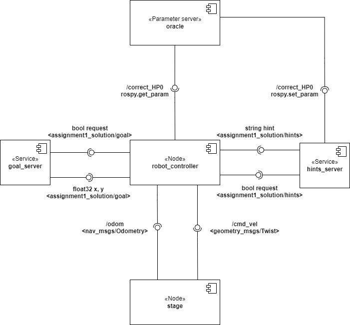
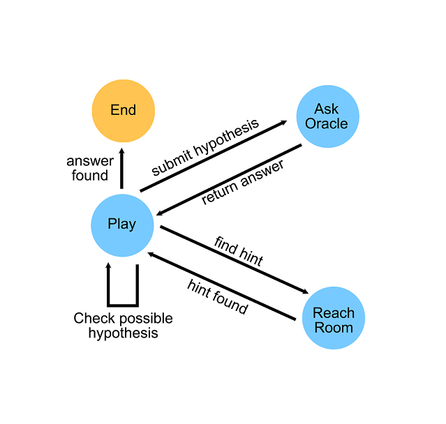

## Overview

This package was developed as a solution of the first assignment of the Experimental Robotics Laboratory course of Robotics Engineering held by Professors Buoncompagni Luca and Recchiuto Carmine. The package recreates the ontology of cluedo boardgame, while a robot reach random goals in a 2d space in ros stage.

### Licence

**Author: Leonardo Spinelli 
Affiliation: University of Genoa 
Maintainer: Leonardo Spinelli, leonardo.spinelli91@gmail.com**

The erl_assignment1 package has been tested under ROS Melodic on Ubuntu 16.04.6 LTS.

## Architecture

The main node is **robot_controller** which works as a FSM. The controller asks to the **goal_server** for random positions to acquire in the ROS stage environment. The request is a bool while the response from the server comes as a couple of float describing x and y positions. The idea is to simulate the player of Cluedo reaching different rooms to find hints, in this case the rooms are exploited as random positions. Once a goal is reached, the robot_controller retrieves a hint from the **hints_server**. The hint consists in a string which contains a prefix with the identifier. When the robot controller has received three hints with the same identifier, it checks if the hypothesis formulated with those identifiers is consistent. If the hypothesis is consistent the robot_controller commands the robot to go to x=0 and y=0 position, then it asks the oracle (parameter server) whether the hypothesis is correct.

## Behaviour

## Video

### Building from source

To build from source, clone the latest version from this repository into your catkin workspace and compile the package using:

	cd catkin_workspace/src
	git clone https://github.com/LeonardoSpi/erl_assignment1
	cd ..
	catkin_make

Remember to make scripts executable, in the scripts folder use the following commands:

	chmod +x robot_controller.py
	chmod +x goal_server.py
	chmod +x hints_server.py
	
Check files permission with:
	
	ls -l

## Usage

To run the solution you can use the solution.launch file:

	roslaunch erl_assignment1 erl_assignment1.launch

## Launch files

* **erl_assignment1.launch** This launch file will starts 4 nodes: stage, hints_server, goal_server, robot_controller.

	- **'stage'** Spawn the robot in the ros stage environment.

	- **'hints_server'** Start a service server node which will associate IDs to different hints source from a list picked randomly. When a consistent hypothesis is
	randomly generated with three hints from the same source ID, the ID is saved as a rosparam in the parameter server. When the hints_server receives a request it
	answers with a string made by "ID, who/what/where, hint", the hint is deleted from the list to prevent the user to pick it multiple times.

	- **'goal_server'** Start a service server for random goals.

	- **'robot_controller'** An automated state machine that navigates throught random goals in order to find hints. When a consistent hypothesis is found the 		robot_controller check whether the ID corresponds to the one saved in the parameter server by the hints_server. If the guess is correct the node shuts down,
	otherwise it continues.

	- The launch files also loads an empty param called correct_HP0, which will be filled by the hints_server.	

### Services

* **`goal_generator`** ([erl_assignment1/goal])

		bool request
	_ _ _
		float32 x
	
		float32 y
 
 
* **`hints_generator`** ([erl_assignment1/hints])

		bool request
	_ _ _
		string hint
	

